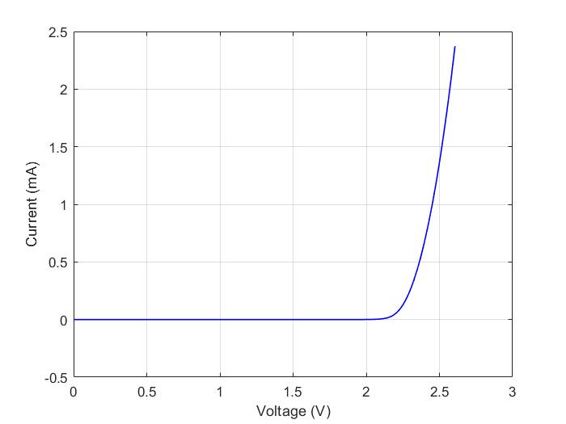

# I-V Curve Generation Arduino Shield #
- - - -
#### Arduino and Matlab Code for ECEN 5730, Fall 2020, Graduate Board Design Project ####
#### Jake Michael and Shamanth Pranesharao ####

- - - - 
### Introduction ###
For our design project in ECEN 5730 PCB Design at CU Boulder, Fall 2020, our team designed a two layer PCB that can measure a Current vs. Voltage (I-V) characteristic curve and transmit this data over UART for plotting. The shield is compatible with the Arduino Uno pinout and can measure the I-V characteristic of most two terminal components (resistors, diodes, etc.). We refer to this component as the Device Under Test (DUT). The shield also has an onboard LED which can act as the DUT by closing a jumper connection on the board. Finally, the current sense resistor can be switched out to maximize the voltage resolution for a wide range of components.

- - - -
### Design ### 
We attempted to use best PCB design practices during the design of the board and thus we placed all decoupling capacitors as close to their IC's as practical and utilized a continuous ground plane as the bottom layer. The shield was designed to allow an Arduino to communicate with two onboard IC's via I2C: 
* DAC - MCP4725, single channel 12-bit
* ADC - ADS1115, two differential channels 16-bit

The DAC sets a voltage which proceeds through a buffer (to allow higher current DUT's). The buffered DAC output connects to the positive terminal of the DUT which is in series with a current sense resistor. The ADC then measures the differential voltages across the DUT and the current sense resistor. Finally, these ADC measurements are sent out over UART to an external computer. 

- - - - 
### Code ###
Since the ATmega328P does not have a floating point unit, we left the ADC readings as raw values for processing by a computer with a bit more power. We used a Matlab script (also provided in this repo) to collect, process, and plot the data from the Arduino. The Arduino code is quite simple and relies on two Arduino libraries: 
* "Adafriut_MCP4725" - the library for setting DAC output. Further info: https://learn.adafruit.com/mcp4725-12-bit-dac-tutorial/using-with-arduino
* "ADS1115_WE" - the library for reading ADC inputs. Further info: https://wolles-elektronikkiste.de/ads1115

The Arduino waits to recieve the ascii string "START" from Matlab. Once it gets this command, it initiates a pulse-mode sweep of the DAC from 0 V to 4.088 V. At each DAC setpoint, the ADC measures the voltage across the DUT and the sense resistor and transmits the raw values to Matlab. Then, the DAC is set to 0 V for some delay period so that the DUT or current sense resistor do not burn up during testing.   
- - - -
### Example I-V Curve of Green LED (Onboard DUT) ###

